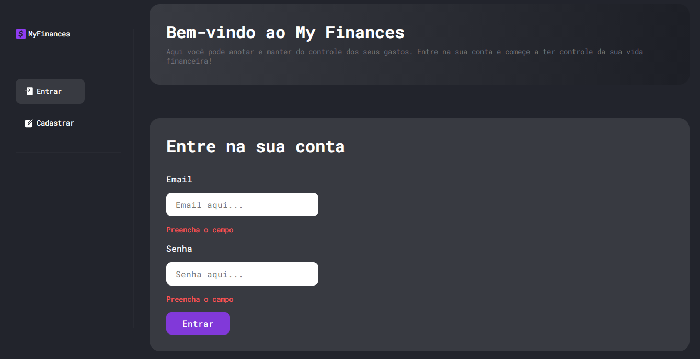
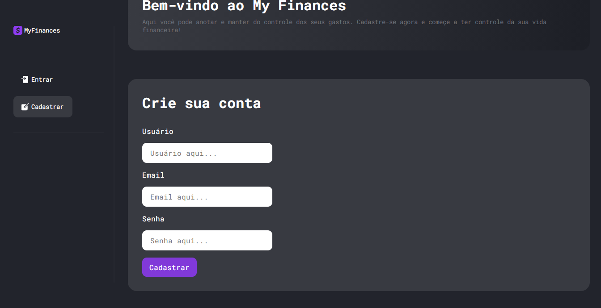

# My Finances Front end
An app for you to keep track of your finances. My Finances is a modern project built with the most advanced existing technologies in the market. Built with
Next.js, Styled-components, Redux, Framer Motion and more, My Finances is fast and good-looking web application on which you can create a budget and start to
keep track of your money by adding, editing or deleting your earnings and expenses. You can visit the website <a href="https://myfinances.vercel.app" target="_blank">here</a>.

# Sign-in and Sign-up
The application has lots of features and two of them are the ability to create your own account and then use it to have access to your information wherever you are
and on any device.

# History page
From here you can access your budget, earnings and expenses. You can also delete, edit or add more entries.

# Single Page
Both the earnings and the expenses have a single page on which you can also add, edit and delete them.

# My Finances Back end
For the project's back end, it was created an API with Strapi which is a headless Content Management System. It was created custom routes, policies, custom
controlers and collection-types to handle with different types of HTTP requests. The My Finances Strapi application is hosted on Heroku.
